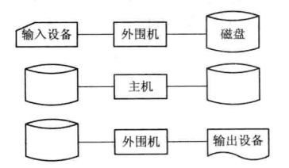
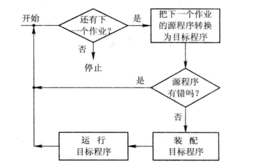
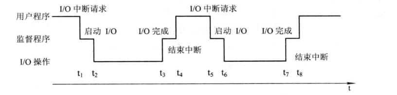
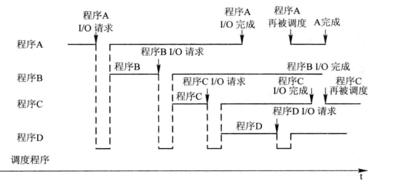

在20世纪50年代中期，出现了第一个简单的批处理OS;60年代中期开发出多道程序批处理系统;不久又推出分时系统，与此同时，用于工业和武器控制的实时OS也相继问世。20世纪70到90年代，是VLSI和计算机体系结构大发展的年代，导致了微型机、多处理机和计算机网络的诞生和发展，与此相应地，也相继开发出了微机OS、多处理机OS和网络OS，并得到极为迅猛的发展。

# 1.2.1 未配置操作系统的计算机系统

从1945年诞生的第一台计算机，到50年代中期的计算机，都属于第一代计算机。这时还未出现OS，对计算机的全部操作都是由用户采取人工操作方式进行的。

## 1. 人工操作方式

早期的操作方式是由程序员将事先已穿孔的纸带(或卡片)，装入纸带输入机(或卡片输入机)，再启动它们将纸带(或卡片)上的程序和数据输入计算机，然后启动计算机运行。仅当程序运行完毕并取走计算结果后,才允许下一个用户上机。这种人工操作方式有以下两方面的缺点:
(1)用户独占全机，即一台计算机的全部资源由上机用户所独占。
(2) CPU等待人工操作。当用户进行装带(卡)、卸带(卡)等人工操作时，CPU 及内存等资源是空闲的。
可见，人工操作方式严重降低了计算机资源的利用率，此即所谓的人机矛盾。虽然CPU的速度在迅速提高，但I/O设备的速度却提高缓慢，这使CPU与IO设备之间速度不匹配的矛盾更加突出。为此，曾先后出现了通道技术、缓冲技术，然而都未能很好地解决上述矛盾，直至后来引入了脱机输入/输出技术，才获得了相对较为满意的结果。

## 2. 脱机输入/输出（Off-line I/O）方式

为了解决人机矛盾及CPU和IO设备之间速度不匹配的矛盾，20世纪50年代末出现了脱机IO技术。该技术是事先将装有用户程序和数据的纸带装入纸带输入机，在一台外围机的控制下，把纸带(卡片)上的数据(程序)输入到磁带上。当CPU需要这些程序和数据时，再从磁带上高速地调入内存。

类似地，当CPU需要输出时，可先由CPU把数据直接从内存高速地输送到磁带上，然后在另一台外围机的控制下,再将磁带上的结果通过相应的输出设备输出。图1-3示出了脱机输入/输出过程。由于程序和数据的输入和输出都是在外围机的控制下完成的，或者说，它们是在脱离主机的情况下进行的，故称为脱机输入/输出方式。反之，把在主机的直接控制下进行输入/输出的方式称为联机输入/输出(On-Line I/O)方式。这种脱机IO方式的主要优点为：

(1)减少了CPU的空闲时间。装带、卸带，以及将数据从低速IO设备送到高速磁带上(或反之)的操作，都是在脱机情况下由外围机完成的，并不占用主机时间，从而有效地减少了CPU的空闲时间。
(2）提高了I/O速度。当CPU在运行中需要输入数据时，是直接从高速的磁带上将数据输入到内存的，这便极大地提高了I/O速度，从而进一步减少了CPU的空闲时间。

# 1.2.2 单道批处理系统

20世纪50年代中期出现了第二代晶体管计算机，此时计算机虽已具有推广应用的价值，但计算机系统仍然非常昂贵。为了能充分地提高它的利用率，应尽量保持系统的连续运行，即在处理完一个作业后，紧接着处理下一个作业，以减少机器的空闲等待时间。

## 1. 单道批处理系统(Simple Batch Processing System)的处理过程

为实现对作业的连续处理，需要先把一批作业以脱机方式输入到磁带上，并在系统中配上监督程序(Monitor)，在它的控制下，使这批作业能一个接一个地连续处理。其处理过程是:首先由监督程序将磁带上的第一个作业装入内存，并把运行控制权交给该作业;当该作业处理完成时，又把控制权交还给监督程序，再由监督程序把磁带上的第二个作业调入内存。计算机系统就这样自动地一个作业紧接一个作业地进行处理，直至磁带上的所有作业全部完成，这样便形成了早期的批处理系统。虽然系统对作业的处理是成批进行的，但在内存中始终只保持一道作业，故称为单道批处理系统。图1-4示出了单道批处理系统的处理流程。

由上所述不难看出，单道批处理系统是在解决人机矛盾和CPU与IO设备速度不匹配矛盾的过程中形成的。换言之，批处理系统旨在提高系统资源的利用率和系统吞吐量。但这种单道批处理系统仍然不能充分地利用系统资源，故现已很少使用。

## 2.单道批处理系统的缺点

单道批处理系统最主要的缺点是，系统中的资源得不到充分的利用。这是因为在内存中仅有一道程序，每逢该程序在运行中发出IO请求后，CPU便处于等待状态，必须在其I/O完成后才继续运行。又因IO设备的低速性，更使CPU的利用率显著降低。图1-5示出了单道程序的运行情况，从图可以看出:在to～t3、t6～tz时间间隔内CPU空闲。

为了能在系统中运行较大的作业，通常在计算机中都配置了较大容量的内存，但实际情况是有80%以上的作业都属于中小型，因此在单道程序环境下，也必定造成内存的浪费。类似地，为了满足各种类型的作业需要，在系统中将会配置多种类型的I/O 设备。显然在单道程序环境下也不能充分利用系统资源。

# 1.2.3 多道批处理系统(Multiprogrammed Batch Processing System)

20世纪60年代中期，IBM公司生产了第一台小规模集成电路计算机IBM 360(第三代计算机系统)。由于它较之于晶体管计算机无论在体积、功耗、速度和可靠性上都有了显著的改善，因而获得了极大的成功。IBM公司为该机开发的OS/360操作系统是第一个能运行多道程序的批处理系统。

## 1．多道程序设计的基本概念

为了进一步提高资源的利用率和系统吞吐量，在20世纪60年代中期引入了多道程序设计技术，由此形成了多道批处理系统。在该系统中，用户所提交的作业先存放在外存上，并排成一个队列，称为“后备队列”。然后由作业调度程序按一定的算法，从后备队列中选择若干个作业调入内存，使它们共享CPU和系统中的各种资源。由于同时在内存中装有若干道程序,这样便可以在运行程序A时,利用其因I/O操作而暂停执行时的CPU空档时间，再调度另一道程序B运行，同样可以利用程序B在IO操作时的CPU空档时间，再调度程序C运行，使多道程序交替地运行，这样便可以保持CPU处于忙碌状态。图1-6示出了四道程序时的运行情况。

## 2.多道批处理系统的优缺点

多道批处理系统的优缺点如下:

(1)资源利用率高。引入多道批处理能使多道程序交替运行，以保持CPU处于忙碌状态;在内存中装入多道程序可提高内存的利用率;此外还可以提高IO设备的利用率。
(2系统吞吐量大。能提高系统吞吐量的主要原因可归结为:1 CPU和其它资源保持“忙碌”状态;②仅当作业完成时或运行不下去时才进行切换，系统开销小。
(3)平均周转时间长。由于作业要排队依次进行处理，因而作业的周转时间较长，通常需几个小时，甚至几天。
(4)无交互能力。用户一旦把作业提交给系统后，直至作业完成，用户都不能与自己的作业进行交互，修改和调试程序极不方便。

## 3.多道批处理系统需要解决的问题

多道批处理系统是一种十分有效，但又非常复杂的系统，为使系统中的多道程序间能协调地运行，系统必须解决下述一系列问题:
(1)处理机争用问题。既要能满足各道程序运行的需要，又要能提高处理机的利用率。(2)内存分配和保护问题。系统应能为每道程序分配必要的内存空间，使它们“各得其所”，且不会因某道程序出现异常情况而破坏其它程序。
(3) IO设备分配问题。系统应采取适当的策略来分配系统中的I/O设备，以达到既能方便用户对设备的使用，又能提高设备利用率的目的。
(4)）文件的组织和管理问题。系统应能有效地组织存放在系统中的大量的程序和数据，使它们既便于用户使用，又能保证数据的安全性。
(5)作业管理问题。系统中存在着各种作业(应用程序)，系统应能对系统中所有的作业进行合理的组织，以满足这些作业用户的不同要求。
(6)用户与系统的接口问题。为使用户能方便的使用操作系统，OS还应提供用户与oS之间的接口。
为此，应在计算机系统中增加一组软件，用以对上述问题进行妥善、有效的处理。这组软件应包括:能有效地组织和管理四大资源的软件、合理地对各类作业进行调度和控制它们运行的软件，以及方便用户使用计算机的软件。正是这样一组软件构成了操作系统。据此，我们可把操作系统定义为:操作系统是一组能有效地组织和管理计算机硬件和软件资源，合理地对各类作业进行调度，以及方便用户使用的程序的集合。

# 1.2.4 分时系统(Time Sharing System)

## 1．分时系统的引入

如果说推动多道批处理系统形成和发展的主要动力是提高资源利用率和系统吞吐量，那么，推动分时系统形成和发展的主要动力，则是为了满足用户对人一机交互的需求，由此形成了一种新型OS。用户的需求具体表现在以下几个方面:
(1)人一机交互。每当程序员写好一个新程序时，都需要上机进行调试。由于新编程序难免存在一些错误或不当之处，需要进行修改，因此用户希望能像早期使用计算机时一样，独占全机并对它进行直接控制，以便能方便地对程序中的错误进行修改。亦即，用户希望能进行人—机交互。
(2）共享主机。在 20世纪60年代，计算机还十分昂贵，一台计算机要同时供很多用户共享使用。显然，用户们在共享一台计算机时，每人都希望能像独占时一样，不仅可以随时与计算机进行交互，而且还不会感觉到其他用户的存在。
由上所述不难得知，分时系统是指，在一台主机上连接了多个配有显示器和键盘的终端并由此所组成的系统，该系统允许多个用户同时通过自己的终端，以交互方式使用计算机，共享主机中的资源。

## 2.分时系统实现中的关键问题

在多道批处理系统中，用户无法与自己的作业进行交互的主要原因是:作业都先驻留在外存上，即使以后被调入内存，也要经过较长时间的等待后方能运行，用户无法与自己的作业进行交互。为了能够实现人—机交互，必须解决的关键问题是，如何使用户能与自己的作业进行交互。为此，系统首先必须能提供多个终端，同时给多个用户使用;其次，当用户在自己的终端上键入命令时，系统应能及时接收，并及时处理该命令，再将结果返回给用户。此后，用户可根据系统返回的响应情况，再继续键入下一条命令，此即人一机交互。亦即，允许有多个用户同时通过自己的键盘键入命令，系统也应能全部及时接收并处理。
1)及时接收
要做到及时接收多个用户键入的命令或数据，只需在系统中配置一个多路卡即可。例如当主机上需要连接64个终端时，就配置一个64用户的多路卡。多路卡的作用是，实现分时多路复用。即主机以很快的速度周期性地扫描各个终端，在每个终端处停留很短的时间，如 30 ms，用于接收从终端发来的数据。对于64用户的多路卡，用不到2秒的时间便可完成一次扫描，即主机能用不到2秒的时间分时接收各用户从终端上输入的数据一次。此外，为了能使从终端上输入的数据被依次逐条地进行处理，还需要为每个终端配置一个缓冲区，用来暂存用户键入的命令(或数据)。
2)及时处理
人—机交互的关键在于，用户键入命令后，能对自己的作业及其运行及时地实施控制，或进行修改。因此，各个用户的作业都必须驻留在内存中，并能频繁地获得处理机运行。否则，用户键入的命令将无法作用到自己的作业上。由此可见，为实现人一机交互，必须彻底地改变原来批处理系统的运行方式，转而采用下面的方式:
(1)作业直接进入内存。因为作业在磁盘上是不能运行的，所以作业应直接进入内存。

(2)采用轮转运行方式。如果一个作业独占CPU连续运行，那么其它的作业就没有机会被调度运行。为避免一个作业长期独占处理机，引入了时间片的概念。一个时间片，就是一段很短的时间(例如 30 ms)。系统规定每个作业每次只能运行一个时间片，然后就暂停该作业的运行，并立即调度下一个作业运行。如果在不长的时间内能使所有的作业都执行一个时间片的时间，便可以使每个用户都能及时地与自己的作业进行交互，从而可使用户的请求得到及时响应。

## 3.分时系统的特征

分时系统与多道批处理系统相比,具有非常明显的不同特性,可以归纳成以下四个方面;(1)多路性。该特性是指系统允许将多台终端同时连接到一台主机上，并按分时原则为每个用户服务。多路性允许多个用户共享一台计算机，显著地提高了资源利用率，降低了使用费用，从而促进了计算机更广泛的应用。
(2）独立性。该特性是指系统提供了这样的用机环境，即每个用户在各自的终端上进行操作，彼此之间互不干扰，给用户的感觉就像是他一人独占主机进行操作。
(3)及时性。及时性是指用户的请求能在很短时间内获得响应。这一时间间隔是根据人们所能接受的等待时间确定的，通常仅为1～3秒钟。
(4)交互性。交互性是指用户可通过终端与系统进行广泛的人机对话。其广泛性表现在:用户可以请求系统提供多方面的服务，如进行文件编辑和数据处理，访问系统中的文件系统和数据库系统，请求提供打印服务等。

# 1.2.5实时系统(Real Time System)

所谓“实时”，是表示“及时”，而“实时计算”，则可以定义为这样一类计算:系统的正确性，不仅由计算的逻辑结果来确定，而且还取决于产生结果的时间。事实上实时系统最主要的特征，是将时间作为关键参数，它必须对所接收到的某些信号做出“及时”或“实时”的反应。由此得知，实时系统是指系统能及时响应外部事件的请求，在规定的时间内完成对该事件的处理，并控制所有实时任务协调一致地运行。

## 1．实时系统的类型

随着计算机应用的普及，实时系统的类型也相应增多，下面列出当前常见的几种:(1)工业(武器)控制系统。当计算机被用于生产过程的控制，形成以计算机为中心的控制系统时，该系统应具有能实时采集现场数据，并对所采集的数据进行及时处理，进而能够自动地控制相应的执行机构，使之具有按预定的规律变化的功能，确保产品的质量和产量。类似地，也可将计算机用于对武器的控制，如火炮的自动控制系统、飞机的自动驾驶系统，以及导弹的制导系统等。
(2)信息查询系统。该系统接收从远程终端上发来的服务请求，根据用户提出的请求，对信息进行检索和处理，并能及时对用户做出正确的回答。实时信息处理系统有飞机或火车的订票系统等。
(3)多媒体系统。随着计算机硬件和软件的快速发展，已可将文本、图像、音频和视频等信息集成在一个文件中，形成一个多媒体文件。如在用DVD播放器所播放的数字电影中就包含了音频、视频和横向滚动的文字等信息。为了保证有好的视觉和听觉感受，用于播放音频和视频的多媒体系统等，也必须是实时信息处理系统。
(4)嵌入式系统。随着集成电路的发展，已制做出各种类型的芯片，可将这些芯片嵌入到各种仪器和设备中，用于对设备进行控制或对其中的信息做出处理，这样就构成了所谓的智能仪器和设备。此时还需要配置嵌入式OS,它同样需要具有实时控制或处理的功能。

## 2.实时任务的类型

(1)周期性实时任务和非周期性实时任务。周期性实时任务是指这样一类任务，外部设备周期性地发出激励信号给计算机，要求它按指定周期循环执行，以便周期性地控制某外部设备。反之，非周期性实时任务并无明显的周期性，但都必须联系着一个截止时间(Deadline)，或称为最后期限。它又可分为:①开始截止时间，指某任务在某时间以前必须开始执行;②完成截止时间，指某任务在某时间以前必须完成。
(2）硬实时任务和软实时任务。硬实时任务(Hard Real-time Task，HRT)是指系统必须满足任务对截止时间的要求，否则可能出现难以预测的后果。用于工业和武器控制的实时系统，通常它所执行的是硬实时任务。软实时任务(Soft Real-time Task，SRT)也联系着一个截止时间，但并不严格，若偶尔错过了任务的截止时间，对系统产生的影响也不会太大。诸如用于信息查询系统和多媒体系统中的实时系统，通常是软实时任务。

## 3.实时系统与分时系统特征的比较

(1)多路性。信息查询系统和分时系统中的多路性都表现为系统按分时原则为多个终端用户服务;实时控制系统的多路性则是指系统周期性地对多路现场信息进行采集，以及对多个对象或多个执行机构进行控制。
(2)独立性。信息查询系统中的每个终端用户在与系统交互时，彼此相互独立互不干扰;同样在实时控制系统中，对信息的采集和对对象的控制也都是彼此互不干扰的。
(3及时性。信息查询系统对实时性的要求是依据人所能接受的等待时间确定的，而多媒体系统实时性的要求是，播放出来的音乐和电视能令人满意。实时控制系统的实时性则是以控制对象所要求的截止时间来确定的，一般为秒级到毫秒级。
(4)交互性。在信息查询系统中，人与系统的交互性仅限于访问系统中某些特定的专用服务程序。它并不像分时系统那样，能向终端用户提供数据处理、资源共享等服务。而多媒体系统的交互性也仅限于用户发送某些特定的命令，如开始、停止、快进等，由系统立即响应。
(5)可靠性。分时系统要求系统可靠，实时系统要求系统高度可靠，因为任何差错都可能带来无法预料的灾难性后果。因此，在实时系统中，往往都采取了多级容错措施来保障系统的安全性及数据的安全性。

# 1.2.6微机操作系统的发展

随着VLSI 和计算机体系结构的发展，以及应用需求的不断扩大，操作系统仍在继续发展。由此先后形成了微机操作系统、网络操作系统等，本小节对微机操作系统的发展作扼要的介绍。

配置在微型机上的操作系统称为微机操作系统，最早诞生的微机操作系统是配置在8位微机上的CP/M。后来出现了16位微机，相应地，16位微机操作系统也就应运而生，当微机发展为32位、64位时，32位和64位微机操作系统也应运而生。可见微机操作系统可按微机的字长来分，但也可将它按运行方式分为如下几类:

## 1．单用户单任务操作系统

单用户单任务操作系统的含义是，只允许一个用户上机，且只允许用户程序作为一个任务运行，这是最简单的微机操作系统，主要配置在8位和16位微机上，最有代表性的单用户单任务微机操作系统是CP/M 和MS-DOS。

1) CP/M

1974年第一代通用8位微处理机芯片Intel 8080出现后的第二年，Digital Research公司就开发出带有软盘系统的8位微机操作系统。1977年 Digital Research公司对CPM进行了重写，使其可配置在以Intel 8080、8085、Z80等8位芯片为基础的多种微机上。1979年又推出带有硬盘管理功能的CP/M 2.2版本。由于CP/M具有较好的体系结构,可适应性强，可移植性以及易学易用等优点，使之在8位微机中占据了统治地位。

2) MS-DOS

1981年IBM公司首次推出了IBM-PC个人计算机(16位微机)，在微机中采用了微软公司开发的MS-DOS(Disk Operating System)操作系统，该操作系统在CPM的基础上进行了较大的扩充，使其在功能上有很大的提高。1983年 IBM推出 PC/AT(配有Intel 80286芯片)，相应地微软又开发出MS-DOS 2.0版本，它不仅能支持硬盘设备，还采用了树形目录结构的文件系统。1987年又宣布了MS-DOS 3.3版本。从MS-DOS 1.0到3.3为止的版本都属于单用户单任务操作系统，内存被限制在640 KB。从1989到1993年又先后推出了多个MS-DOS版本，它们都可以配置在Intel 80386、80486等32位微机上。从80年代到90年代初，由于MS-DOS性能优越受到当时用户的广泛欢迎，成为事实上的16位单用户单任务操作系统标准。

## 2.单用户多任务操作系统

单用户多任务操作系统的含义是，只允许一个用户上机，但允许用户把程序分为若干个任务，使它们并发执行，从而有效地改善了系统的性能。目前在32位微机上配置的操作系统，基本上都是单用户多任务操作系统。其中最有代表性的是由微软公司推出了Windows。1985年和1987年微软公司先后推出了Windows 1.0和Windows 2.0版本操作系统，由于当时的硬件平台还只是16位微机，对1.0和2.0版本不能很好地支持。1990年微软公司又发布了Windows 3.0版本，随后又宣布了Windows 3.1版本，它们主要是针对386和486等32位微机开发的，它较之以前的操作系统有着重大的改进，引入了友善的图形用户界面，支持多任务和扩展内存的功能。使计算机更好使用，从而成为386和486等微机的主流操作系统。
1995年微软公司推出了Windows 95，它较之以前的Windows 3.1有许多重大改进，采用了全32位的处理技术，并兼容以前的16位应用程序，在该系统中还集成了支持 Internet的网络功能。1998年微软公司又推出了 Windows 95的改进版 Windows 98，它已是最后一个仍然兼容以前的16 位应用程序的Windows。其最主要的改进是把微软公司自己开发的Internet浏览器整合到系统中，大大方便了用户上网浏览;另一个改进是增加了对多媒体的支持。2001年微软又发布了 Windows XP，同时提供了家用和商业工作站两种版本，在此后相当长的一段时间，成为使用最广泛的个人操作系统之一。在开发上述Windows操作系统的同时，微软公司又开始对网络操作系统Windows NT进行开发，它是针对网络开发的操作系统，在系统中融入许多面向网络的功能，从2006年后推出的一系列内核版本号为NT6.X的桌面及服务器操作系统，包括Windows Vista、Windows Server 2008、Windows 7、Windows Server 2008 R2、Windows 8和 Windows Server 2012等,这里就不对它们进行介绍。

## 3．多用户多任务操作系统

多用户多任务操作系统的含义是，允许多个用户通过各自的终端，使用同一台机器，共享主机系统中的各种资源，而每个用户程序又可进一步分为几个任务，使它们能并发执行，从而可进一步提高资源利用率和系统吞吐量。在大、中和小型机中所配置的大多是多用户多任务操作系统，而在32位微机上，也有不少配置的是多用户多任务操作系统，其中最有代表性的是UNIX OS。
UNIX OS是美国电报电话公司的Bell实验室在1969~1970年期间开发的，1979年推出来的UNIX V.7已被广泛应用于多种中小型机上。随着微机性能的提高，人们又将UNIX移植到微机上。在1980年前后，将UNIX第7版本移植到Motorola 公司的MC 680xx微机上，后来又将UNIX V7.0版本进行简化后，移植到Intel 8080 上，把它称为Xenix。现在最有影响的两个能运行在微机上的UNIX操作系统变形是Solaris OS和 Linux OS.
(1) Solaris OS: SUN公司于1982年推出的SUN OS 1.0，是一个运行在MOTOROLA680X0 平台上的 UNIX OS，在 1988年宣布的SUN OS 4.0，把运行平台从早期的MOTOROLA 680X0平台迁移到SPARC平台，并开始支持Intel公司的Intel 80X86;1992年SUN发布了Solaris 2.0。从1998年开始，Sun公司推出64位操作系统Solaris 2.7和2.8，这几款操作系统在网络特性、互操作性、兼容性以及易于配置和管理方面均有很大的提高。
(2) Linux OS:Linux是UNIX的一个重要变种，最初是由芬兰学生Linus Torvalds针对Intel 80386开发的，1991年，在Internet网上发布第一个Linux版本，由于源代码公开，因此有很多人通过Internet 与之合作，使 Linux 的性能迅速提高，其应用范围也日益扩大，相应地，源代码也急剧膨胀，此时它已是具有全面功能的UNIX系统，大量在 UNIX上运行的软件(包括1000多种实用工具软件和大量网络软件)，被移植到Linux 上，而且可以在主要的微机上运行，如Intel 80X86 Pentium等。

